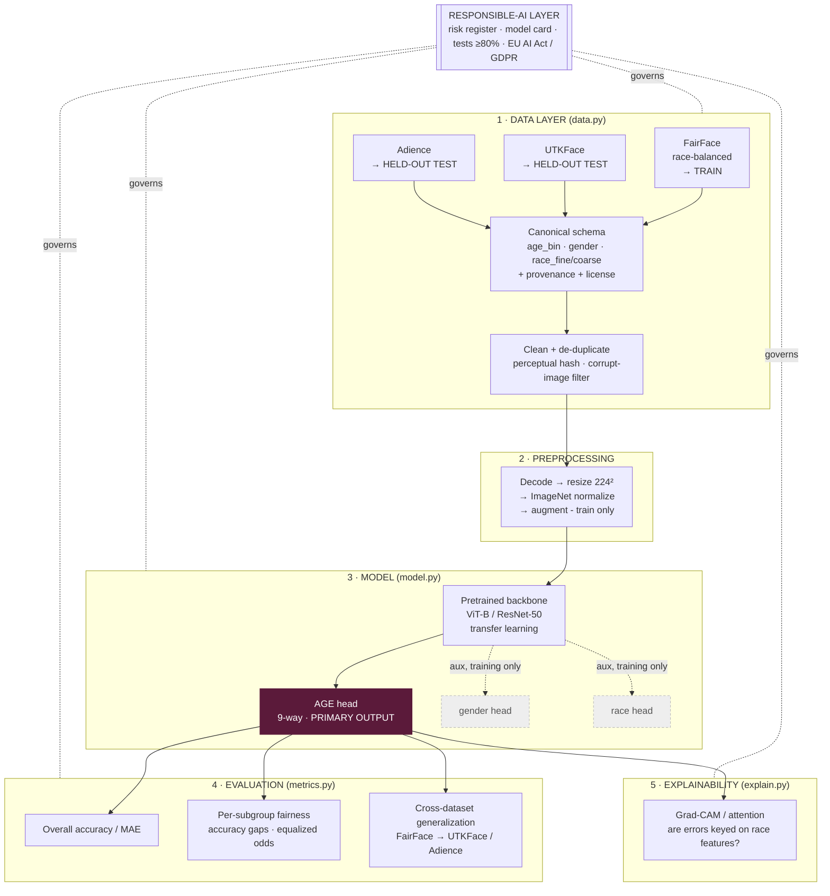

# Responsible Age Classifier for Retail Analytics

> A **gender-neutral, race-agnostic age-group classifier** for anonymous retail
> footfall analytics — built as a *responsible AI* system: fair across
> demographics, explainable, tested, and compliant by design.
>
> Course: **Responsible AI & Data Ethics** (SS2026). Deliverable: a documented,
> runnable Jupyter notebook backed by the `face_age/` package.

---

## What this system does (and deliberately does NOT do)

| Does | Does **not** do |
|------|-----------------|
| Estimate a coarse **age group** (9 buckets) from a face | Identify or recognise **who** a person is |
| Produce **anonymous, aggregate** analytics (e.g. "30 % of visitors were 20–29 today") | Store faces, embeddings, or biometric templates |
| Use gender/race labels **only internally**, to audit and prove fairness | Expose or output gender/race at deployment |

This distinction is the ethical core of the project: it is **age estimation for
aggregate analytics**, *not* face recognition. It is designed to fall **outside**
the "biometric identification" category of the EU AI Act (see
[Regulatory Analysis](#regulatory-analysis)).

---

## Table of Contents
1. [Goal & Framing](#what-this-system-does-and-deliberately-does-not-do)
2. [System Architecture](#system-architecture)
3. [The Data Strategy](#the-data-strategy)
4. [Model Design](#model-design)
5. [Responsible-AI Layer](#responsible-ai-layer)
6. [Regulatory Analysis](#regulatory-analysis)
7. [Tech Stack](#tech-stack)
8. [Project Structure](#project-structure)
9. [Setup & Running](#setup--running)
10. [Project Status](#project-status)
11. [Risks & Limitations](#risks--limitations)

---

## System Architecture

The system is organised as **five layers**. Data flows upward; the
Responsible-AI layer wraps every stage.



**Key architectural decisions**

1. **Train on FairFace, test on unseen UTKFace + Adience.** FairFace is
   race-balanced by construction, so it stays a clean, balanced training anchor.
   Proving the model still works on datasets it *never saw* is a stronger
   responsibility story than training on more (imbalanced) rows.
2. **Multi-task, single-output.** The backbone learns shared face features; a
   primary **age head** plus **auxiliary gender/race heads**. The auxiliary heads
   exist *only* to measure and mitigate bias during training/evaluation — they are
   **never exposed at deployment**. This is what makes the system "race-agnostic"
   in a measurable, not just aspirational, way.
3. **Transfer learning, not from scratch.** A pretrained backbone converges fast
   and needs far less data — appropriate for the timeframe and dataset size.

---

## The Data Strategy

Three datasets, three distinct jobs. **Not merged** — kept as a train/test split
across sources so fairness metrics stay interpretable (merging would confound
"which dataset" with "which subgroup").

| Dataset | Role | Age | Gender | Race | License |
|---------|------|:---:|:------:|:----:|---------|
| **FairFace** | **Train anchor** (balanced) | ✅ 9 bins | ✅ | ✅ 7 | CC BY 4.0 |
| **UTKFace** | Held-out test | ✅ | ✅ | ✅ 5 | Non-commercial research |
| **Adience** | Held-out test | ✅ | ✅ | ❌ | Research |

**Rejected:** CASIA-WebFace and MegaFace — no age labels (wrong task) *and*
consent/ethics concerns (MegaFace decommissioned 2020; CASIA scraped without
consent). Excluding them is itself a responsible-AI point.

All three are harmonised by `data.py` into one **canonical schema** with two race
columns: `race_fine` (7-way, FairFace-only reliable) and `race_coarse`
(White/Black/Asian/Indian/Other/Unknown — the common scheme used for
cross-dataset fairness). Every row carries `dataset_source`, original labels, and
`license` for full provenance.

---

## Model Design

```
Input face 224×224×3
      │
      ▼
Pretrained backbone (ViT-B/16 or ResNet-50)   ← ImageNet weights, fine-tuned
      │  shared 768-d (ViT) / 2048-d (ResNet) feature vector
      ├───────────────► Age head    → softmax over 9 age bins   [DEPLOYED]
      ├───────────────► Gender head → 2-way    (training only)  [audit]
      └───────────────► Race head   → 5-way    (training only)  [audit]

Loss = age_loss + λ_g · gender_loss + λ_r · race_loss   (auxiliary weighted low)
```

- **Backbone:** start with one, keep the other as a comparison baseline.
- **Imbalance:** class weights / targeted augmentation on starved age×race cells,
  decided *after* EDA.
- **Baseline first:** a plain single-task age classifier is built first as the
  Week-2 baseline; the auxiliary heads are added on top.

---

## Responsible-AI Layer

| Concern | How it is addressed |
|---------|---------------------|
| **Fairness** | Per-subgroup accuracy & equalized-odds-style gaps on `race_coarse` and gender; the whole train/test design targets this. |
| **Explainability (XAI)** | Grad-CAM / attention maps on correct *and* misclassified subgroup samples — checking the model keys on age cues, not race-correlated features. |
| **Robustness / Testing** | `pytest` suite incl. invariance tests (skin-tone/lighting shifts shouldn't swing age); target ≥ 80 % coverage. |
| **Transparency** | Pseudo-**Model Card** at the end of the notebook: intended use, limitations, biases, attacks, restrictions. |
| **Privacy** | Data minimisation by design — no identity, no stored faces/embeddings, only aggregate age buckets. |

---

## Regulatory Analysis

- **EU AI Act:** deliberately designed to avoid the *prohibited*/high-risk
  "biometric identification & categorisation" bucket — the system estimates a
  coarse age group for **aggregate** analytics and does **not** identify
  individuals or output demographic categories. Age-inference for footfall
  analytics is treated as **limited/minimal-risk**, with transparency obligations
  met via this documentation and model card.
- **GDPR:** faces are special-category biometric data *only* when used to uniquely
  identify a person — which this system explicitly does not do. Principles applied:
  **data minimisation** (no raw-image retention, aggregate outputs only),
  **purpose limitation** (analytics only), and honest handling of the **training
  data's own licence** (UTKFace is non-commercial — a real deployment blocker,
  documented rather than hidden).

*(Full write-up: [`regulatory_analysis.md`](regulatory_analysis.md) — paste directly into the notebook's Regulatory section as markdown cells.)*

---

## Tech Stack

| Layer | Tool |
|-------|------|
| Language | Python 3.11 |
| Data / tables | pandas, numpy |
| Images | Pillow (+ perceptual hashing, dependency-free) |
| Model | PyTorch + Hugging Face `transformers` / `timm` |
| Fairness | fairlearn (per-subgroup metrics) |
| Explainability | Captum / Grad-CAM |
| Testing | pytest + pytest-cov |
| Presentation | Jupyter Notebook |

---

## Project Structure

```
Code/
├── README.md                 # this file
├── face_age/                 # importable, testable package
│   ├── __init__.py
│   ├── data.py               # ✅ loading, canonical schema, cleaning, dedup
│   ├── model.py              # ⬜ backbone + age/aux heads
│   ├── metrics.py            # ⬜ subgroup fairness metrics
│   └── explain.py            # ⬜ Grad-CAM / attention XAI
├── tests/                    # ⬜ pytest suite (≥80% coverage)
├── data/                     # (git-ignored) raw datasets
│   ├── fairface/  utkface/  adience/
└── FaceRecognition_Project.ipynb   # ⬜ the graded deliverable/presentation
```

---

## Setup & Running

```bash
# from the Code/ folder
pip install pandas numpy pillow torch transformers timm fairlearn captum \
            pytest pytest-cov

# place datasets under Code/data/{fairface,utkface,adience}/  then:
python face_age/data.py        # smoke test: loads + summarises what's present
```

> On this machine, use the working venv Python
> (`ML practice/ml_env/Scripts/python.exe`) — the system Python is broken.

---

## Project Status

| Component | Status |
|-----------|:------:|
| Data loading + canonical schema (`data.py`) | ✅ done |
| Cleaning + perceptual-hash de-duplication | ✅ done, tested |
| EDA (in notebook) | 🟡 pending data download |
| Baseline model | ⬜ Week 2 |
| Fairness metrics | ⬜ Week 2 |
| XAI (Grad-CAM) | ⬜ Week 3 |
| Test suite ≥ 80 % | ⬜ Week 3 |
| Model card + management pitch | ⬜ Week 4 |

Delivery **2026-07-20** · Presentation **2026-07-24**.

---

## Risks & Limitations

- **Label noise across datasets** — age binning and race taxonomies differ; lossy
  mappings are documented, not hidden.
- **Age is subjective/coarse** — 9 bins, not exact age; apparent ≠ actual age.
- **Adience has no race label** — excluded from race-fairness metrics by design.
- **Training-data licence** — UTKFace is non-commercial; real deployment would need
  differently-licensed data.
- **Residual bias possible** — even balanced data can leave subgroup gaps; the
  point is to *measure and report* them, not claim they are zero.
```
