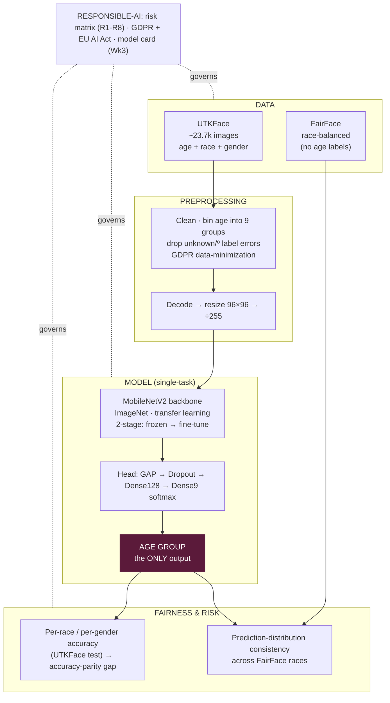

# Responsible Age Classifier for Retail Analytics

> A **gender-neutral, race-agnostic age-group classifier** for anonymous retail
> footfall analytics — built as a *responsible AI* system: fairness is measured,
> not assumed; risks and limitations are documented, not hidden.
>
> Course: **Responsible AI & Data Ethics** (SS2026).
> Deliverable: **`Code/Responsible_Age_Classifier_Week1_2.ipynb`** — a single,
> documented, runnable Jupyter notebook.

---

## What this system does (and deliberately does NOT do)

| Does | Does **not** do |
|------|-----------------|
| Estimate a coarse **age group** (9 buckets) from a face | Identify or recognise **who** a person is |
| Produce **anonymous** age predictions for aggregate analytics | Store faces, embeddings, or biometric templates |
| Use gender/race labels **only to audit fairness** after training | Ever take gender/race as a model **input** — or output them at all |

This is **age estimation for analytics**, *not* face recognition. The model sees
only raw pixels and outputs only an age group; race and gender are used purely as
ground-truth labels to *check* that accuracy is fair across groups.

---

## Table of Contents
1. [Goal & Framing](#what-this-system-does-and-deliberately-does-not-do)
2. [Datasets](#datasets)
3. [System / Pipeline Architecture](#system--pipeline-architecture)
4. [Model Design](#model-design)
5. [Results](#results)
6. [Fairness Analysis](#fairness-analysis)
7. [Responsible-AI Coverage](#responsible-ai-coverage)
8. [Regulatory Analysis](#regulatory-analysis)
9. [Tech Stack](#tech-stack)
10. [Project Structure](#project-structure)
11. [Setup & Running](#setup--running)
12. [Project Status](#project-status)
13. [Risks & Limitations](#risks--limitations)

---

## Datasets

**Two datasets are used, for two different jobs. They are NOT merged.**

| Dataset | Role | Age labels | Race | License | Why |
|---------|------|:----------:|:----:|---------|-----|
| **UTKFace** | **Training** + per-group accuracy testing | ✅ per-image | ✅ 5 | Non-commercial research | Only dataset with real per-image age **and** race + gender labels — the only one that can train an age model |
| **FairFace** (Kaggle race mirror) | **Fairness testing only** | ❌ none | ✅ 7 | CC BY 4.0 | Balanced across 7 races → ideal for auditing bias; used to check prediction *consistency* across races |

**Not used:**
- **Adience — dropped.** Too small (~3k usable), coarse age *ranges* only, and **no race labels** — so it can't contribute to the race-fairness analysis that is the point of the project.
- **CASIA-WebFace, MegaFace — rejected.** Face-*identity* datasets with **no age labels** (wrong task), plus consent/ethics problems (MegaFace was decommissioned in 2020; CASIA was scraped without consent).

> ⚠️ **`crop_part1` is NOT a separate dataset.** UTKFace's Kaggle package ships
> `utkface/`, `crop_part1/`, and `utkface_aligned_cropped/`. Verified: `crop_part1`
> is **9,779/9,780 duplicate images already in `utkface/`**. We use **`utkface/`
> only** — adding `crop_part1` would inject duplicates and cause train/test leakage.

---

## System / Pipeline Architecture



**Key design decisions**

1. **Train on UTKFace, fairness-test on FairFace.** UTKFace is the only source
   with real per-image age labels (needed to train). FairFace is race-balanced,
   making it ideal to *audit* the trained model for race bias.
2. **Single-task by design — the model never computes race or gender.** Race and
   gender are *never* model inputs or outputs; they exist only as dataset labels
   used to slice accuracy for fairness auditing. This is a stronger "race-agnostic"
   guarantee than merely not exposing an internal prediction — the model literally
   cannot output a protected attribute.
3. **Transfer learning (MobileNetV2), not from scratch.** A CPU-friendly
   ImageNet-pretrained backbone converges fast on limited compute.

---

## Model Design

```
Input face 96×96×3   (race & gender NEVER used as input)
      │
      ▼
MobileNetV2 backbone  (ImageNet weights, include_top=False)
      │   Stage 1: fully frozen   ·   Stage 2: last 30 layers fine-tuned @ 10× lower LR
      ▼
GlobalAveragePooling2D → Dropout(0.5) → Dense(128, ReLU) → Dense(9, softmax)
      │
      ▼
Age group ∈ {0-2, 3-9, 10-19, 20-29, 30-39, 40-49, 50-59, 60-69, 70+}
```

- **Loss:** categorical cross-entropy · **Optimizer:** Adam · **EarlyStopping** on val accuracy
- **Class weights** applied to compensate for age-group imbalance (few 0-2 / 60-69 / 70+)
- **Two-stage training:** (1) train the head with the backbone frozen; (2) unfreeze
  the last 30 backbone layers at a 10× lower learning rate to specialize on faces
- **Why classification, not regression:** retail analytics needs age *bands*, and
  classification gives a probability per band (adjacent-class confusion is the
  accepted cost — addressed by a planned Week-3 "one-off accuracy" metric)

---

## Results

*(From the run of 6 July 2026 — re-run the evaluation cells to refresh.)*

| Metric | Value |
|--------|-------|
| Stage-1 test accuracy (frozen backbone) | 43.06% |
| **Final test accuracy (after fine-tuning)** | **46.16%** |
| Train / Val / Test split | 16,578 / 3,553 / 3,553 |
| Chance baseline (9 classes) | 11.1% → model is ~4× better than random |

~46% reflects strict scoring (predicting "30-39" for a 41-year-old counts as fully
wrong) and CPU-limited input size (96×96). What matters more here is **fairness
consistency**, below.

---

## Fairness Analysis

**Named metric: accuracy parity** — the gap between the best- and worst-performing group.

**Per-race accuracy (UTKFace test set):**

| Race | Accuracy |
|------|----------|
| Asian | 55.62% |
| Other | 48.12% |
| Indian | 48.00% |
| White | 43.68% |
| Black | 42.52% |
| **Overall** | **46.16%** |

**Accuracy parity gap: 13.10 pp** (Asian best, Black worst). Notably the majority
White class lands *below* average — a counterintuitive result that measurement
revealed and assumption would have missed (candidate causes analyzed in the notebook).

Two complementary methods are used: **per-race / per-gender accuracy** on UTKFace
(has ground-truth ages), and **prediction-distribution consistency** across
FairFace's balanced races (no ages → consistency, not correctness).

---

## Responsible-AI Coverage

| Concern | How it is addressed | Status |
|---------|---------------------|:------:|
| **Fairness** | Per-race & per-gender accuracy parity + FairFace consistency | ✅ Week 2 |
| **Risk** | R1-R8 risk matrix (likelihood/impact/treatment) + worked examples | ✅ Week 2 |
| **Privacy** | GDPR data-minimization: no identity, no face storage, age-only output; minors flagged | ✅ Week 1 |
| **Regulatory** | GDPR + EU AI Act analysis (see below) | ✅ Week 1 |
| **Explainability (XAI)** | Grad-CAM on last conv layer — tests Risk R3 (proxy features) | ⬜ Week 3 |
| **Testing** | `pytest` suite (age binning, parsing, split integrity, fairness-regression check), ≥80% coverage | ⬜ Week 3 |
| **Model card** | Mitchell-et-al. style pseudo-model-card | ⬜ Week 3-4 |

---

## Regulatory Analysis

Full write-up lives in the notebook's **Week 1 → Regulatory Analysis** section
(also in [`Code/regulatory_analysis.md`](Code/regulatory_analysis.md)). Summary:

- **EU AI Act:** **Not prohibited** (Art. 5 bans inferring *sensitive* attributes;
  age is not one, and we never infer race/gender). **High-risk status is genuinely
  ambiguous** (Annex III 1(b) covers categorization by *sensitive* attributes — age
  arguably isn't), so a real deployer should get a formal assessment.
  **Transparency (Art. 50)** applies regardless — in-store signage is mandatory.
- **GDPR:** Faces are special-category biometric data only when used for *unique
  identification*, which this system does not do — but we adopt the conservative
  Art. 9 treatment anyway. Principles applied: **data minimization**, **purpose
  limitation**, and honest handling of UTKFace's **non-commercial licence** (a real
  deployment blocker). A **DPIA** would be mandatory before any real deployment.

---

## Tech Stack

| Layer | Tool |
|-------|------|
| Language | Python 3.11 |
| Model | **TensorFlow / Keras** — MobileNetV2 (transfer learning) |
| ML utilities | scikit-learn (split, class weights, metrics) |
| Data / images | pandas, numpy, Pillow |
| Visualization | matplotlib, seaborn |
| Presentation | Jupyter Notebook |
| *Planned (Week 3)* | pytest + pytest-cov · Grad-CAM |

> Note: `Code/face_age/data.py` is an **optional local helper** (canonical-schema
> loaders + dedup) used for local analysis on Windows. The graded notebook is
> **self-contained** and does not depend on it.

---

## Project Structure

```
Face Recognition Project/
├── README.md                                   # this file
├── exam topic and guidelines.pdf
└── Code/
    ├── Responsible_Age_Classifier_Week1_2.ipynb   # ★ THE deliverable (Keras, trained, Wk1+Wk2)
    ├── UTKface(train)fface(test).ipynb            # earlier draft (superseded)
    ├── regulatory_analysis.md / Regulatory_Analysis.docx   # standalone regulatory reference
    └── face_age/
        ├── __init__.py
        └── data.py                                # optional local data-loader utility

Datasets live OUTSIDE the repo (git-ignored):
  D:\nihal\utkface\      ← training
  D:\nihal\fairface\     ← fairness testing
```

---

## Setup & Running

**The canonical notebook runs in a cloud JupyterHub** (paths under
`/home/jovyan/work/data/`) and downloads its own data via the Kaggle API.

```bash
pip install tensorflow scikit-learn pandas numpy pillow matplotlib seaborn kaggle
# open Responsible_Age_Classifier_Week1_2.ipynb and run top-to-bottom
# (a "Recovery Cell" reloads the saved model + splits after a restart)
```

**To run locally instead:** change the `BASE` path in the notebook's Path-Setup
cell to point at your local `utkface/` and `fairface/` folders (e.g. `D:\nihal`).

---

## Project Status

| Week | Goals | Status |
|------|-------|:------:|
| **Week 1** | Data analysis · plan · architecture · regulatory analysis | ✅ done |
| **Week 2** | Baseline model · risk analysis · fairness analysis | ✅ done |
| **Week 3** | Model analysis · XAI (Grad-CAM) · tests ≥80% coverage | ⬜ planned |
| **Week 4** | Documentation · model card · management pitch · presentation | ⬜ planned |

Delivery **2026-07-20** · Presentation **2026-07-24**.

---

## Risks & Limitations

- **13.1 pp race accuracy gap** (Asian vs Black) that class weights did not close — the dominant open fairness risk (R1).
- **Elderly / infant faces underrepresented** in UTKFace — weaker on 0-2 and 70+ despite class weights (R5).
- **Distribution shift** — UTKFace is cropped, frontal, well-lit; real camera conditions (angle, lighting, occlusion, masks) are untested (R6).
- **FairFace has no age labels** — fairness on it is *consistency*, not *accuracy*; exact per-race accuracy comes from UTKFace only (R8).
- **Non-consensual training data & non-commercial licence** — no commercial deployment would be defensible without re-sourcing lawfully licensed data.
- **Age is coarse & apparent** — 9 bands, not exact age; adjacent-band errors count as wrong.
```
